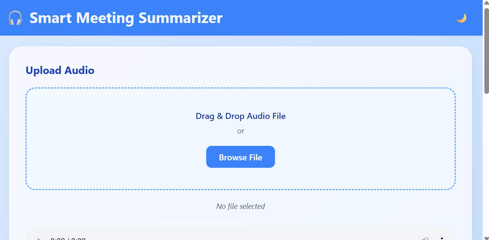
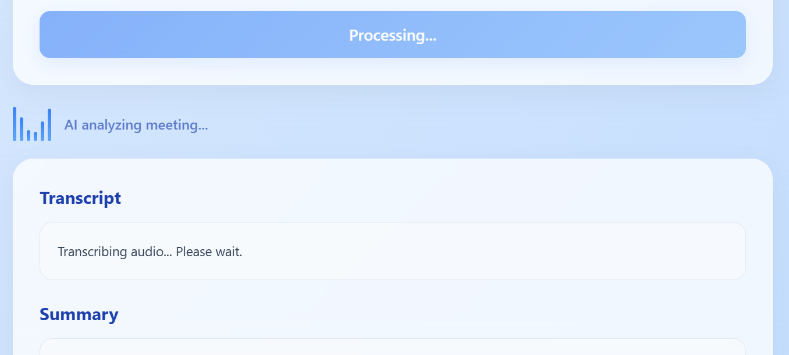
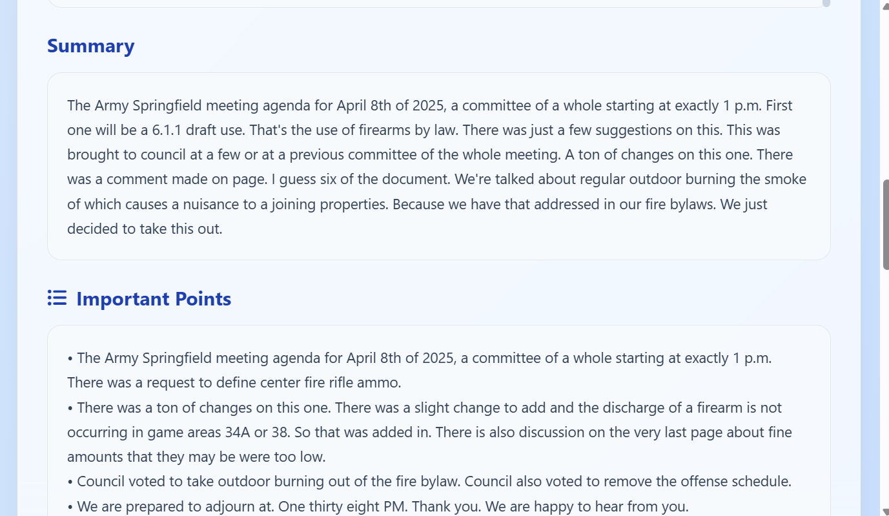
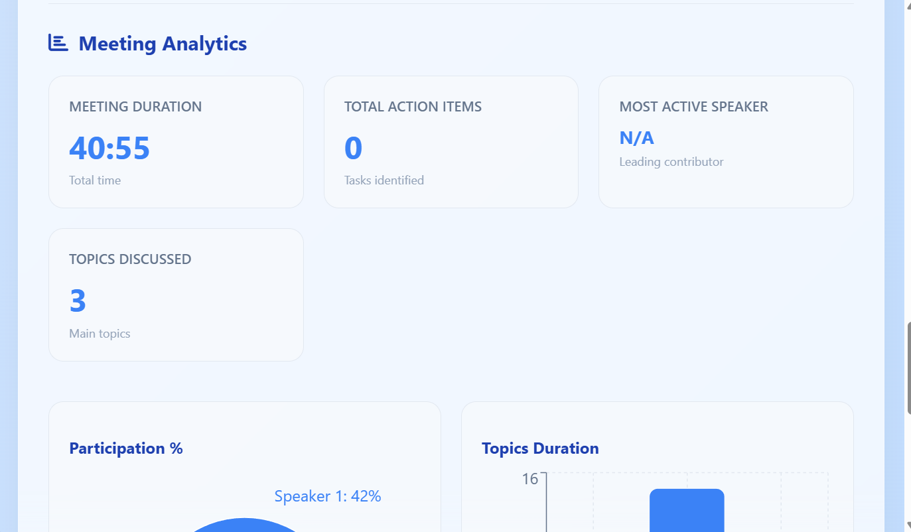
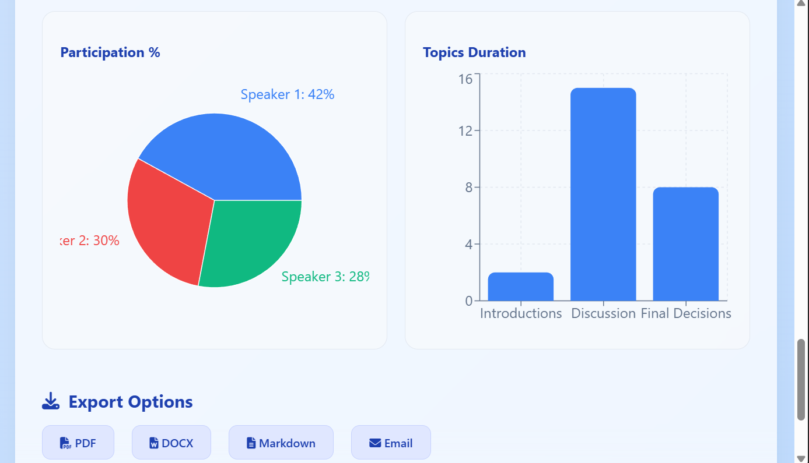

# Smart Meeting Summarizer 

A comprehensive meeting analysis tool that transcribes audio, generates summaries, extracts action items, identifies speakers, and provides detailed analytics.

## ✨  Features 
- 🎤 Upload and play audio meeting files
- 🧠 AI-powered transcription and summarization
- 📌 Automatic extraction of key discussion points
- ⏱️ Timeline view of meeting events with timestamps
- 👥 Speaker identification and participation analysis
- ✅ Smart action item detection with task breakdown
- 📊 Analytics dashboard (duration, participation, topics)
- 📤 Export meeting data (PDF, DOCX, Markdown, Email)
- 🌙 Dark mode support
- ⚡ Real-time processing animation with status updates

## 📸 Screenshots

### 🟦 Upload Screen

### ⚙️ Processing State

### 📝 Summary Output

### 📊 Analytics Dashboard

